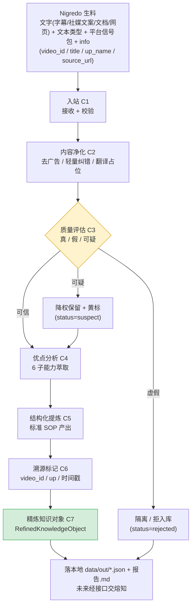

# 炼真（Albedo）数据流程框图

> 本图定义「一条生料文本 → 一份鉴定报告（精炼知识对象）」的数据流。
> MVP 只做**单源闭环**；多源矛盾检测、时效判定为规模期（见 PROJECT_PLAN 版本路线）。业务线适配评估已移出炼真（归 Rubedo / OpusMagnum）。质量评估为**多维**（真实性/文案/结构/逻辑），v0.1.0 先做真实性维度；输入带「文本类型」标记、平台信号由 Nigredo 归一化传入。
> 分面分类（UDC facet）**不在此图**——那是熔知知识库底层索引代码，由 Citrinitas 完成。

---

## 一、主干流程（MVP 最小闭环）



**说明**：质量评估（多维）以「真实性」维度为分叉点——虚假直接隔离，可疑降权但保留（不替你拍板），可信才进入优点分析。文案/结构/逻辑维度在 v0.2.0 补全，作为报告丰富度，不影响 status 分叉。三条路径最终都产出 `RefinedKnowledgeObject`，只是 `status` 不同，便于下游（熔知）按可信度分级存储。

---

## 二、节点定义表

| 节点 | 名称 | 输入 | 输出 | 逻辑 | 对应任务 |
|---|---|---|---|---|---|
| C1 | 入站 | Nigredo `process()` 产出的文本（字幕/社媒文案/文档/网页，当前以 B站 为主）+ 文本类型标记 + 平台归一化信号包 + info | `AlbedoInput`（text / text_type / signals / video_id / title / up_name / source_url） | 校验非空、字段归一、按 text_type 选净化/评估策略 | T1 / T7 / T11 |
| C2 | 内容净化 | `AlbedoInput.text` + `text_type` | `clean_text` | 按文本类型处理：字幕走 ASR 清洗（去语气词/纠错），结构化文案直提炼；去广告话术（卖课特征模式库）、多语言翻译占位 | T2 |
| C3 | 质量评估（多维） | `clean_text` + `provenance` + `signals` | `quality{truthfulness, copywriting, structure, logic}` + `monetization{related, category}` | 分维度评估：真实性（LLM + 统计：跨源共识/数值自洽）驱动 status；文案/结构/逻辑 v0.2.0 补全；signals 作辅助信号；同步检测变现相关（复用卖课话术特征） | T3 / T8 |
| C4 | 优点分析 | `clean_text` | `merits{核心洞察, 可复用步骤, 差异化亮点, 适用场景, 陷阱预警, 迁移成本}` | LLM 结构化萃取 6 子能力 | T4 / T8 |
| C5 | 结构化提炼 | `clean_text` + `merits.可复用步骤` | `sop{目的, 前置条件, 编号步骤, 警告, 完成清单}` | 对齐 TubeScribed 标准 SOP 格式，保证 Rubedo 可直接消费 | T5 / T8 |
| C6 | 溯源标记 | Nigredo `info` | `provenance{video_id, up_name, source_url, title, processed_at}` | 精炼阶段即记录来源（天然产物） | T6 |
| C7 | 精炼知识对象 | C2–C6 全部输出 | `RefinedKnowledgeObject`（含 trust_score + status + references + monetization + report） | 组装 + 由 quality.label 推 status + FPF 轻量信任分 + 引用标记 + 变现标注 + 渲染人类可读报告 | T1 / T7 / T12 |

---

## 三、任务映射（Phase 1 → 节点）

| 任务 | 节点 | 版本归属 |
|---|---|---|
| T1 数据契约 `core/models.py` | C1 / C7 | v0.1.0 |
| T2 内容净化 `core/purify.py` | C2 | v0.1.0 |
| T3 质量评估 `core/assess.py` | C3 | v0.1.0 |
| T7 流水线编排（最小）`flows/refine.py` | C1→C7 | v0.1.0 |
| T8 LLM 调用封装 `core/llm.py` | C3 | v0.1.0 |
| T9 最小 UI `app.py` + `run.bat` | C7 | v0.1.0 |
| T4 优点分析 `core/merit.py` | C4 | v0.2.0 |
| T5 结构化提炼 `core/structure.py` | C5 | v0.2.0 |
| T6 溯源 `core/provenance.py` | C6 | v0.2.0 |
| T7+ 流水线补全 `flows/refine.py` | C1→C7 | v0.2.0 |
| T11 批量/队列（方案A） | C1 | v0.2.0 |

---

## 四、与上下游的接口边界

```
Nigredo ──(字幕 full_text + info)──▶ Albedo ──(RefinedKnowledgeObject)──▶ Citrinitas
                                          │                                      │
                                     只做认知精炼                          只做存储索引
                                     (验真假/提优点/                         (分面分类/
                                      整理步骤/记来源)                       切块/向量化/入库)
```

- **Albedo 不碰**：采集（Nigredo）、分面分类/OCR/切块/向量化/入库（Citrinitas）、创作变现（Rubedo）、意图重写（OpusMagnum）、产品化封装（Rubedo）
- **Albedo 交付物** `RefinedKnowledgeObject` 的 `quality.label` 直接映射熔知 `epistemic_status`（真→corroborated / 可疑→unverified / 假→rejected），`trust_score` 直接填入熔知 payload `trust_score` 字段
- **平台无关 + 文本类型感知**：Albedo 只消费「文字」，不绑采集平台；但按「文本类型」(字幕/社媒文案/文档) 调整净化与评估策略。平台元数据由 Nigredo 归一化为统一信号包（互动热度/受众契合/口碑）后传入，Albedo 只吃归一化信号，不碰原始平台字段。
