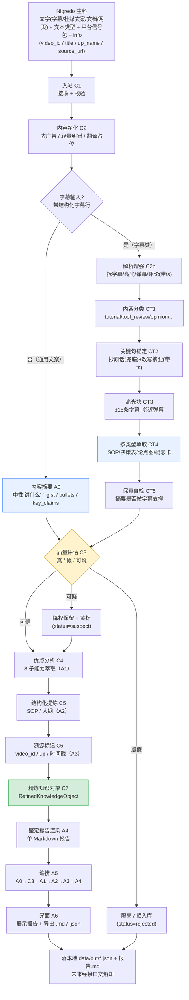

# 炼真（Albedo）数据流程框图

> 本图定义「一条生料文本 → 一份鉴定报告（精炼知识对象）」的数据流。
> MVP 只做**单源闭环**；多源矛盾检测、时效判定为规模期（见 PROJECT_PLAN 版本路线）。业务线适配评估已移出炼真（归 Rubedo / OpusMagnum）。质量评估为**多维**（真实性/文案/结构/逻辑），v0.1.0 先做真实性维度；输入带「文本类型」标记、平台信号由 Nigredo 归一化传入。
> 分面分类（UDC facet）**不在此图**——那是熔知知识库底层索引代码，由 Citrinitas 完成。

---

## 一、主干流程（MVP 最小闭环）



**说明**：净化后先产一份**中性内容摘要 A0**（gist / bullets / key_claims，不评级不判真假），作报告开头与下游压缩基底，再进入质量评估。质量评估（多维）以「真实性」维度为分叉点——虚假直接隔离，可疑降权但保留（不替你拍板），可信才进入优点分析。文案/结构/逻辑维度在 v0.2.0 补全（A1 优点 8 子能力 / A2 结构化），作为报告丰富度，不影响 status 分叉。三条路径最终都产出 `RefinedKnowledgeObject`，只是 `status` 不同，便于下游（熔知）按可信度分级存储。

---

## 二、节点定义表

| 节点 | 名称 | 输入 | 输出 | 逻辑 | 对应任务 |
|---|---|---|---|---|---|
| C1 | 入站 | Nigredo `process()` 产出的文本（字幕/社媒文案/文档/网页，当前以 B站 为主）+ 文本类型标记 + 平台归一化信号包 + info | `AlbedoInput`（text / text_type / signals / video_id / title / up_name / source_url） | 校验非空、字段归一、按 text_type 选净化/评估策略 | T1 / T7 / T11 |
| C2 | 内容净化 | `AlbedoInput.text` + `text_type` | `clean_text` | 按文本类型处理：字幕走 ASR 清洗（去语气词/纠错），结构化文案直提炼；去广告话术（卖课特征模式库）、多语言翻译占位 | T2 |
| A0 | 内容摘要（基础层） | `clean_text` | `summary{gist, bullets, key_claims}` | 中性"讲什么"，排净化后、评估前；与 merits / assess 严格分离，作报告开头与压缩基底 | A0(#711) |
| C3 | 质量评估（多维） | `clean_text` + `provenance` + `signals` | `quality{truthfulness, copywriting, structure, logic}` + `monetization{related, category}` | 分维度评估：真实性（LLM + 统计：跨源共识/数值自洽）驱动 status；文案/结构/逻辑 v0.2.0 补全；signals 作辅助信号；同步检测变现相关（复用卖课话术特征） | T3 / T8 |
| C4 | 优点分析 | `clean_text` | `merits{8 子能力：核心洞察, 可复用步骤, 差异化亮点, 适用场景, 陷阱预警, 迁移成本, presentation_craft, format_reusable}` | LLM 2 次调用萃取（内容轴 6 + 形式轴 2）；形式轴不参与 trust_score | A1(#696) / T8 |
| C5 | 结构化提炼 | `clean_text` + `merits.可复用步骤` | `sop{目的, 前置条件, 编号步骤, 警告, 完成清单}`（structure_type=sop）或 `outline{概述, 章节}`（其他 family）；STRUCTURE_EXTRACTORS 注册表插拔即扩 | 对齐 TubeScribed SOP；非 sop 按家族产大纲，承载多题材兼容 | A2(#697) / T8 |
| C6 | 溯源标记 | Nigredo `info` | `provenance{video_id, up_name, source_url, title, processed_at}` | 纯函数不调 LLM，精炼阶段即记录来源（UTC 时间戳，缺字段留空） | A3(#698) |
| C7 | 精炼知识对象 | C2–C6 全部输出 | `RefinedKnowledgeObject`（含 trust_score + status + references + monetization + report + **ingestion_meta**） | 组装 + 由 quality.label 推 status + FPF 轻量信任分 + 引用标记 + 变现标注 + 渲染人类可读报告（内嵌 ingestion_meta 预填熔知分面，入库直读直存） | T1 / T7 / T12 / T14 |
| A4 | 鉴定报告渲染 | `RefinedKnowledgeObject` | 人读 Markdown 报告（单报告，ADR-004） | 以 A0.summary 开头 + 优点 + 结构化 + 溯源 + 数值预检；降级维度显"（该维度未能生成）" | A4(#699) |
| A5 | 编排补全 | 各层输出 | `out.report` | try/except 包裹每步，失败→空 dict 续跑；顺序 A0→assess→A1→A2→A3→A4 | A5(#701) |
| A6 | 界面扩展 | `out.report` | Streamlit 展示 + 导出 .md / .json | 移除 v0.1.0 内联拼接，改渲染 out.report | A6(#700) |
| C2b | 中转解析增强 | Nigredo 中转① `.md`（YAML frontmatter + `#字幕(带ts)/#高光/#弹幕/#置顶/#高赞/#AI摘要`） | `AlbedoInput.subtitle_lines / highlights / danmaku / comments_pinned / comments_top / ai_conclusion` | 分节解析，旧格式降级不崩（字幕逐条 `[mm:ss] 文本` 来自 Nigredo 上游契约） | — |
| CT1 | 内容分类 | `subtitle_lines` + `title` + `ai_conclusion` | `content_type`（tutorial/tool_review/knowledge/opinion/entertainment/narrative/unknown） | LLM temperature=0 + 固定枚举，失败降级 unknown（确定性） | — |
| CT2 | 关键句锚定（Route A） | `subtitle_lines` | `key_sentences`（原话带ts兜底）+ `summary{gist, bullets[带source_ts]}` | 先抄关键原话（不丢），再改写生成摘要（措辞可变、内容一致、每条指回字幕） | — |
| CT3 | 高光上下文块 | `highlights` + `subtitle_lines` + `danmaku` + 评论 | `highlight_blocks[{ts, subtitle_window±15条, danmaku, comments}]` | 纯函数；每条高光取前后 ±15 条字幕（时间轴锚定）+ 邻近弹幕 | — |
| CT4 | 按类型萃取 | `content_type` + `key_sentences` + `summary` + `highlight_blocks` | `content_extract`（SOP/决策表/论点图/概念卡/大纲，每条带 ts） | 分流萃取；entertainment 标记转形式线 | — |
| CT5 | 保真自检 | `summary.bullets` + `subtitle_lines` | `grounding{checked, ungrounded[]}` | 类 SummaC NLI 蕴含判定，无支撑句标「⚠️无原文支撑」（查编造非查真假） | — |

---

## 三、任务映射（Phase 1 → 节点）

| 任务 | 节点 | 版本归属 |
|---|---|---|
| T1 数据契约 `core/models.py` | C1 / C7 | v0.1.0 |
| T2 内容净化 `core/purify.py` | C2 | v0.1.0 |
| T3 质量评估 `core/assess.py` | C3 | v0.1.0 |
| T7 流水线编排（最小）`flows/refine.py` | C1→C7 | v0.1.0 |
| T8 LLM 调用封装 `core/llm.py` | C3 | v0.1.0 |
| T9 最小 UI `app.py` + `run.bat` | C7 | v0.1.0 |
| A0 内容摘要 `core/summary.py` | C2后·底层（评估前） | v0.2.0 |
| A1 优点分析 `core/merit.py` | C4 | v0.2.0 |
| A2 结构化提炼 `core/structure.py` | C5 | v0.2.0 |
| A3 溯源 `core/provenance.py` | C6 | v0.2.0 |
| A4 鉴定报告渲染 `core/report.py` | C7 | v0.2.0 |
| A5 编排补全 `flows/refine.py` | C1→C7 | v0.2.0 |
| A6 界面扩展 `app.py` | C7 | v0.2.0 |
| T11 批量/队列（方案A） | C1 | v0.2.0（切片 C 后置） |

---

## 四、与上下游的接口边界

```
Nigredo ──(字幕 full_text + info)──▶ Albedo ──(RefinedKnowledgeObject)──▶ Citrinitas
                                          │                                      │
                                     只做认知精炼                          只做存储索引
                                     (验真假/提优点/                         (分面分类/
                                      整理步骤/记来源)                       切块/向量化/入库)
```

- **Albedo 不碰**：采集（Nigredo）、分面分类/OCR/切块/向量化/入库（Citrinitas）、创作变现（Rubedo）、意图重写（OpusMagnum）、产品化封装（Rubedo）
- **Albedo 交付物（单一报告，入库就绪）**：炼真只对外交付**一份人类可读鉴定报告**（Markdown），结构化 JSON 仅作 LLM 内部表示，不另维护双输出（ADR-004）。报告内嵌 `ingestion_meta` 块，**预填熔知入库分面**（content_type / domain UDC / temporal_nature / epistemic_status / trust_score / knowledge_type / target_platform / language / is_personal / access_level 等）——熔知入库直接读取、无需重填重分面（ADR-005）。其中 `quality.truthfulness.label` → 熔知 `epistemic_status`（真→corroborated / 可疑→unverified / 假→rejected），`trust_score` → 熔知 payload `trust_score`。
- **平台无关 + 文本类型感知**：Albedo 只消费「文字」，不绑采集平台；但按「文本类型」(字幕/社媒文案/文档) 调整净化与评估策略。平台元数据由 Nigredo 归一化为统一信号包（互动热度/受众契合/口碑）后传入，Albedo 只吃归一化信号，不碰原始平台字段。
