# 炼真（Albedo）数据流程框图

> 本图定义「一条生料文本 → 一份鉴定报告（精炼知识对象）」的数据流。
> MVP 只做**单源闭环**；多源矛盾检测、时效判定为规模期（见 PROJECT_PLAN 版本路线）。业务线适配评估已移出炼真（归 Rubedo / OpusMagnum）。质量评估为**多维**（真实性/文案/结构/逻辑），v0.1.0 先做真实性维度；输入带「文本类型」标记、平台信号由 Nigredo 归一化传入。
> 分面分类（UDC facet）**不在此图**——那是熔知知识库底层索引代码，由 Citrinitas 完成。

---

## 一、主干流程（MVP 最小闭环）

```mermaid
flowchart TD
    A["Nigredo 生料<br/>文字(字幕/社媒文案/文档/网页) + 文本类型 + 平台信号包 + info<br/>(video_id / title / up_name / source_url)"] --> B["入站 C1<br/>接收 + 校验"]
    B --> C["内容净化 C2<br/>去广告 / 轻量纠错 / 翻译占位"]
    C --> SUB{"字幕输入?<br/>带结构化字幕行"}
    SUB -->|"否（通用文案）"| A0["内容摘要 A0<br/>中性'讲什么'：gist / bullets / key_claims"]
    SUB -->|"是（字幕类）"| CT0["解析增强 C2b<br/>拆字幕/高光/弹幕/评论(带ts)"]
    CT0 --> CT1["内容分类 CT1<br/>tutorial/tool_review/opinion/..."]
    CT1 --> CT2["关键句锚定 CT2<br/>抄原话(兜底)+改写摘要(带ts)"]
    CT2 --> CT3["高光块 CT3<br/>±15条字幕+邻近弹幕"]
    CT3 --> CT4["按类型萃取 CT4<br/>SOP/决策表/论点图/概念卡"]
    CT4 --> CT5["保真自检 CT5<br/>摘要是否被字幕支撑"]
    A0 --> FT["形式线 FT0-FT7<br/>钩子/叙事/节奏/人设/修辞/模板/情绪<br/>+ 说服包装强度(G1→验真)"]
    CT5 --> FT
    FT --> CE0["CE0 形式信号骨架<br/>7维显著度加权(确定性,零LLM)"]
    CE0 --> TT0["TT0 抽原子断言<br/>自一致性 N=3(CE1+CE2)<br/>约束于CE0骨架"]
    TT0 --> CE3["CE3 忠实性自检<br/>字幕子串/模糊匹配(确定性)<br/>ungrounded丢弃"]
    CE3 --> CE4["CE4 主张缓存<br/>cache/{video_id}.claims.json<br/>(复查不重抽)"]
    CE4 --> TT1["验真 TT1<br/>Layer0.5 防瞎编<br/>(断言vs字幕NLI,丢弃无支撑)"]
    TT1 --> TT2["验真 TT2<br/>Layer1a 话术识别<br/>(绝对化/水词/模糊语)"]
    TT2 --> TT3["验真 TT3<br/>Layer1b 自相矛盾<br/>(两两NLI)"]
    TT3 --> TT4["验真 TT4<br/>Layer1c 时效标记<br/>(verified_date+validity_class)"]
    TT4 --> TT5["验真 TT5<br/>Layer2 联网深验<br/>(MiniCheck本地,沙箱标unverified)"]
    TT5 --> L3["Layer3 联网核查框架<br/>(无ALBEDO_SEARCH_API_KEY→pending<br/>诚实降级待联网核查)"]
    L3 --> JUDGE["判定 JUDGE<br/>§6.2 证据链(D-S融合)<br/>逐条证据→真/假/可疑(确定性)"]
    JUDGE --> D{"质量评估 C3 + 验真结论<br/>真 / 假 / 可疑(确定性)"}
    D -->|"虚假"| E["隔离 / 拒入库<br/>(status=rejected)"]
    D -->|"可疑"| F["降权保留 + 黄标<br/>(status=suspect)"]
    D -->|"可信"| G["优点分析 C4<br/>8 子能力萃取（A1）"]
    F --> G
    G --> H["结构化提炼 C5<br/>SOP / 大纲（A2）"]
    H --> I["溯源标记 C6<br/>video_id / up / 时间戳（A3）"]
    I --> J["精炼知识对象 C7<br/>RefinedKnowledgeObject"]
    J --> R["鉴定报告渲染 A4<br/>单 Markdown 报告"]
    R --> FR["报告·形式章节 A4d<br/>🎬 形式分析 + 三轴总览"]
    FR --> AS["编排 A5<br/>A0→C3→A1→A2→A3→A4"]
    AS --> UI["界面 A6<br/>展示报告 + 导出 .md / .json"]
    UI --> K["落本地 data/out/*.json + 报告.md<br/>未来经接口交熔知"]
    E --> K

    style D fill:#fff3cd,stroke:#d39e00
    style J fill:#d4edda,stroke:#28a745
    style A0 fill:#e7f1ff,stroke:#3d7eff
    style CT4 fill:#e7f1ff,stroke:#3d7eff
    style TT0 fill:#fde2e2,stroke:#c0392b
    style TT1 fill:#fde2e2,stroke:#c0392b
    style TT2 fill:#fde2e2,stroke:#c0392b
    style TT3 fill:#fde2e2,stroke:#c0392b
    style TT4 fill:#fde2e2,stroke:#c0392b
    style TT5 fill:#fde2e2,stroke:#c0392b
    style JUDGE fill:#d1ecf1,stroke:#0c5460
    style FT fill:#e8daff,stroke:#6f42c1
    style FR fill:#e8daff,stroke:#6f42c1
    style CE0 fill:#d4edda,stroke:#28a745
    style CE3 fill:#d4edda,stroke:#28a745
    style CE4 fill:#d4edda,stroke:#28a745
    style L3 fill:#fff3cd,stroke:#d39e00
```



**说明**：净化后先产一份**中性内容摘要 A0**（gist / bullets / key_claims，不评级不判真假），作报告开头与下游压缩基底，再进入质量评估。质量评估（多维）以「真实性」维度为分叉点——虚假直接隔离，可疑降权但保留（不替你拍板），可信才进入优点分析。文案/结构/逻辑维度在 v0.2.0 补全（A1 优点 8 子能力 / A2 结构化），作为报告丰富度，不影响 status 分叉。三条路径最终都产出 `RefinedKnowledgeObject`，只是 `status` 不同，便于下游（熔知）按可信度分级存储。

**形式线（Track B）** 在验真前并行运行（FT0-FT7）：分析内容"怎么讲"（钩子/叙事结构/节奏/人设/修辞话术/可复制模板/情绪曲线），其"说服包装强度"经 **G1 反向桥**传给验真——高包装(≥0.7)且证据未验证时额外下调验真信任分（真相错觉防御，防"讲得精彩=可信"误判）；形式分析结果在报告 `A4d` 段与**三轴总览（干货度 / 可信度 / 表达力）**一并呈现。修辞话术识别在形式线做单一来源（`FT4` + `apply_rhetoric_rules`），验真线 `truth_track` 改为 import 消费，避免重复正则维护。

---

## 二、节点定义表

| 节点 | 名称 | 输入 | 输出 | 逻辑 | 对应任务 |
|---|---|---|---|---|---|
| C1 | 入站 | Nigredo `process()` 产出的文本（字幕/社媒文案/文档/网页，当前以 B站 为主）+ 文本类型标记 + 平台归一化信号包 + info | `AlbedoInput`（text / text_type / signals / video_id / title / up_name / source_url） | 校验非空、字段归一、按 text_type 选净化/评估策略 | T1 / T7 / T11 |
| C2 | 内容净化 | `AlbedoInput.text` + `text_type` | `clean_text` | 按文本类型处理：字幕走 ASR 清洗（去语气词/纠错），结构化文案直提炼；去广告话术（卖课特征模式库）、多语言翻译占位 | T2 |
| A0 | 内容摘要（基础层） | `clean_text` | `summary{gist, bullets, key_claims}` | 中性"讲什么"，排净化后、评估前；与 merits / assess 严格分离，作报告开头与压缩基底 | A0(#711) |
| C3 | 质量评估（多维） | `clean_text` + `provenance` + `signals` | `quality{truthfulness, copywriting, structure, logic}` + `monetization{related, category}` | 分维度评估：真实性（LLM + 统计：跨源共识/数值自洽）驱动 status；文案/结构/逻辑 v0.2.0 补全；signals 作辅助信号；同步检测变现相关（复用卖课话术特征） | T3 / T8 |
| C4 | 优点分析 | `clean_text` | `merits{8 子能力：核心洞察, 可复用步骤, 差异化亮点, 适用场景, 陷阱预警, 迁移成本, presentation_craft, format_reusable}` | LLM 2 次调用萃取（内容轴 6 + 形式轴 2）；形式轴不参与 trust_score | A1(#696) / T8 |
| C5 | 结构化提炼 | `clean_text` + `merits.可复用步骤` | `sop{目的, 前置条件, 编号步骤, 警告, 完成清单}`（structure_type=sop）或 `outline{概述, 章节}`（其他 family）；STRUCTURE_EXTRACTORS 注册表插拔即扩 | 对齐 TubeScribed SOP；非 sop 按家族产大纲，承载多题材兼容 | A2(#697) / T8 |
| C6 | 溯源标记 | Nigredo `info` | `provenance{video_id, up_name, source_url, title, processed_at}` | 纯函数不调 LLM，精炼阶段即记录来源（UTC 时间戳，缺字段留空） | A3(#698) |
| C7 | 精炼知识对象 | C2–C6 全部输出 | `RefinedKnowledgeObject`（含 trust_score + status + references + monetization + report + **ingestion_meta**） | 组装 + 由 quality.label 推 status + FPF 轻量信任分 + 引用标记 + 变现标注 + 渲染人类可读报告（内嵌 ingestion_meta 预填熔知分面，入库直读直存） | T1 / T7 / T12 / T14 |
| A4 | 鉴定报告渲染 | `RefinedKnowledgeObject` | 人读 Markdown 报告（单报告，ADR-004） | 以 A0.summary 开头 + 优点 + 结构化 + 溯源 + 数值预检；降级维度显"（该维度未能生成）" | A4(#699) |
| A5 | 编排补全 | 各层输出 | `out.report` | try/except 包裹每步，失败→空 dict 续跑；顺序 A0→assess→A1→A2→A3→A4 | A5(#701) |
| A6 | 界面扩展 | `out.report` | Streamlit 展示 + 导出 .md / .json | 移除 v0.1.0 内联拼接，改渲染 out.report | A6(#700) |
| C2b | 中转解析增强 | Nigredo 中转① `.md`（YAML frontmatter + `#字幕(带ts)/#高光/#弹幕/#置顶/#高赞/#AI摘要`） | `AlbedoInput.subtitle_lines / highlights / danmaku / comments_pinned / comments_top / ai_conclusion` | 分节解析，旧格式降级不崩（字幕逐条 `[mm:ss] 文本` 来自 Nigredo 上游契约） | — |
| CT1 | 内容分类 | `subtitle_lines` + `title` + `ai_conclusion` | `content_type`（tutorial/tool_review/knowledge/opinion/entertainment/narrative/unknown） | LLM temperature=0 + 固定枚举，失败降级 unknown（确定性） | — |
| CT2 | 关键句锚定（Route A） | `subtitle_lines` | `key_sentences`（原话带ts兜底）+ `summary{gist, bullets[带source_ts]}` | 先抄关键原话（不丢），再改写生成摘要（措辞可变、内容一致、每条指回字幕） | — |
| CT3 | 高光上下文块 | `highlights` + `subtitle_lines` + `danmaku` + 评论 | `highlight_blocks[{ts, subtitle_window±15条, danmaku, comments}]` | 纯函数；每条高光取前后 ±15 条字幕（时间轴锚定）+ 邻近弹幕 | — |
| CT4 | 按类型萃取 | `content_type` + `key_sentences` + `summary` + `highlight_blocks` | `content_extract`（SOP/决策表/论点图/概念卡/大纲，每条带 ts） | 分流萃取；entertainment 标记转形式线 | — |
| CT5 | 保真自检 | `summary.bullets` + `subtitle_lines` | `grounding{checked, ungrounded[]}` | 类 SummaC NLI 蕴含判定，无支撑句标「⚠️无原文支撑」（查编造非查真假） | — |
| TT0 | 验真·抽断言 | `key_sentences`（或 clean_text 切句）+ `title` | `claim_verifications[]`（每条含 claim_id/quote/ts/factuality/scope/check_worthy/hedge/weasel） | LLM temperature=0 + 固定枚举抽原子断言，锚定真实原话（防瞎编从源头）；数据模型 `ClaimVerification` 在 `core/models.py` | TT0(#83) |
| CE0 | 抽主张·形式信号骨架 | `subtitle_lines`（带 ts/start/end/text）+ `clean_text`（FT4 规则兜底）+ `danmaku`（FT6 弱代理） | `skeleton[]`（Top-K=12，每句带 ts/原话/显著度/7维信号标签/命中话术/重叠窗口上下文） | **确定性、零 LLM**：7 维显著度加权（pos/dur/rep/rhet/punct/emo/hook，预设权重和=1.0），复用 `form_track.apply_rhetoric_rules` + 伪声学（语速/停顿/标点/字符频率中心度）；治 DeepSeek 不稳的源头 | CE0(#123) |
| CE1+CE2 | 抽主张·自一致性并集 | `skeleton` + `title` | `claims[]`（CE0 约束内抽 N=3 次，归一化去重并集，非投票） | 约束解码 `response_format=json_object` + 固定 CE0 骨架为"必须覆盖范围"；N=3 抽样取并集（某次抽风漏的别的次补上），重叠窗口防跨句主张漏抽 | CE1+CE2(#125) |
| CE3 | 抽主张·忠实性自检 | `claims[]` + `subtitle_lines` | `kept[]`（grounded + anchor_ts）/ 丢弃 ungrounded | **确定性、零 LLM**：每条主张 vs 字幕全文子串/模糊匹配（跨句子句拆分），幻影丢弃（补 faithfulness gap） | CE3(#126) |
| CE4 | 抽主张·缓存 | `video_id` + `claims[]`（CE3 通过后） | `cache/{video_id}.claims.json`（落盘） | 抽完落盘，复查/出报告复用不重抽 → 从协议层冻结 claim_quotes 漂移 | CE4(#127) |
| L3 | 验真·Layer3 联网核查框架 | `claims[]`（Layer2 仍 unverified 的公开事实主张） | `web_status=pending/verified` + 升级 `accuracy/evidence/confidence` | 可插拔检索后端；无 `ALBEDO_SEARCH_API_KEY` → 诚实降级标 `pending`（待联网核查），不臆断；配 key + backend 后接真搜索升级判定 | L3(#128) |
| TT1 | 验真·Layer0.5 防瞎编 | `claim_verifications` + `subtitle_lines` | 丢弃无原文支撑的断言（faithfulness=ungrounded） | 每条抽取断言 vs 字幕原文 NLI，LLM 瞎编的（视频没有的）直接丢弃，防污染（V3 遗漏3） | TT1(#84) |
| TT2 | 验真·话术识别 | `claim_verifications` + `clean_text` | `red_flags` / `weasel_flag` / `hedge_level`（就地写） | 规则不联网：绝对化骗局话术 + 水词 + 模糊语；中文数字归一（"十万"→"10万"） | TT2(#84) |
| TT3 | 验真·自相矛盾 | `claim_verifications` | `contradicts_with` + `accuracy=contradicted` + 矛盾对列表 | 两两 NLI，逻辑必然不实的矛盾对标红 + 证据溯源（纯本地） | TT3(#84) |
| TT4 | 验真·时效标记 | `claim_verifications` | `verified_date` + `validity_class`(timeboxed/evergreen) | 规则不联网：命中平台规则/价格/版本类→timeboxed 限时，接熔知 temporal_nature | TT4(#84) |
| TT5 | 验真·联网深验(MiniCheck真实路径) | `claim_verifications` | `accuracy=supported/contradicted/unverified` + `confidence` + `evidence_grade=L4` | Layer2 MiniCheck 本地真实调用（`core/minicheck_verify.py`，flan-t5-large，本地确定性）；包未装/模型未下载→降级 `unverified`（保守不臆断）。详见 §6.2 验收注 | TT5(#84) |
| TT6 | 验真·聚合 | `claim_verifications` + 丢弃数 | `truth_track{severity, trust_score, epistemic_status, is_personal, contradictions, recency_note, red_flags}` | 逐条汇总为文档级结论（真假/个人公开/可信度），映射进 `ingestion_meta` 落熔知；结论喂给 JUDGE 作证据来源 | TT6(#84) |
| JUDGE | 判定·§6.2 证据链(D-S融合) | `claim_verifications` + `persuasion_polish`(G1) | `truthfulness.label/score/reasoning/evidence_grade`（确定性：真/假/可疑） | 逐条证据→D-S融合→文档级结论，取代 `assess.py` 自由 LLM label；同输入必得同结论（根治 L4 翻转）；G1 高包装+未验证→不轻信真（`core/judgment.py`，v0.4.1 新增） | JUDGE(#94 补) |
| A5c | 验真·编排接入 | 各层输出 | `out.claim_verifications` / `out.truth_track` / `status`（矛盾或话术上调 suspect） | 内容线/通用路径均调 `_run_truth_track`；验真信号上调 status，保守不误伤 | A5c(#85) |
| A4c | 验真·报告渲染 | `RefinedKnowledgeObject` | 报告「🛡️ 逐条验真」段 | 结论卡后插入，每条断言含原话+ts+事实/观点+个人/公开+判定+标记；矛盾对单列 | A4c(#86) |
| FT0 | 形式线·节奏+时长 | `subtitle_lines` | `pacing{speed_wpm, pauses, duration_tier}` | 纯函数不联网：语速/停顿/时长分层(short<180s/mid<900s/long) | FT0(#89) |
| FT1 | 形式线·钩子 | `subtitle_lines[前10秒]` + `title` | `hook{hook_type, strength, hook_text, ts}` | LLM 抽前 10 秒字幕的钩子类型与力度，锚定真实 ts | FT1(#90) |
| FT2 | 形式线·叙事结构 | `subtitle_lines` + `content_type` | `narrative_segments[{ts, title, purpose}]` | LLM 分 3-7 段，每段标 ts+目的（钩子/铺垫/干货/转折/收尾…） | FT2(#90) |
| FT3 | 形式线·人设 | `subtitle_lines` + `title` + `clean_text` | `persona{trust_base, perspective, tags}` | LLM 判可信基底/立场/人设标签（讲得亲切≠可信，仅描述） | FT3(#90) |
| FT4 | 形式线·修辞话术（单一来源） | `subtitle_lines` + `clean_text` | `rhetoric_devices[{type, span_text, ts}]` | 规则兜底绝对化骗局话术/水词/模糊语（中文数字归一）+ LLM 识 22 种说服技巧；`truth_track` 改为 import 消费 | FT4(#90) |
| FT5 | 形式线·可复制模板 | `title` + `narrative_segments` + `persona` | `reusable_template{title_formula, section_skeleton[{ts, purpose}], persona_tags}` | LLM 抽机器可读骨架（供凝华未来消费；炼真只产数据、不生成视频） | FT5(#90) |
| FT6 | 形式线·情绪曲线 | `danmaku` | `emotion_proxy{density_timeline, weak_signal}` | 弹幕密度时间轴弱代理（无弹幕标 weak_signal + 空，诚实不冒充真实留存） | FT6(#90) |
| G1 | 形式线·说服包装强度（反向桥） | `rhetoric_devices` + `persona` | `persuasion_polish`(0-1) | 0-1 说服包装强度；≥0.7 透传验真 aggregate → 证据未验证时信任分额外 -15%（真相错觉防御） | G1(#91) |
| G2 | 形式线·保真自检 | `hook` + `narrative_segments` + `subtitle_lines` | `form_faithfulness{checked, ungrounded[]}` | hook_text 须出现前 10 秒字幕、每段 ts 须是真实字幕时间戳，防 LLM 编结构 | G2(#90) |
| A5d | 形式线·编排接入 | 各层输出 | `out.form_track` / `out.form_score` / `persuasion_polish`（透传验真） | 验真前插 `_run_form_track`，填 form_track/form_score，persuasion_polish 传给 `_run_truth_track` 实现 G1 | A5d(#92) |
| A4d | 形式线·报告渲染 | `RefinedKnowledgeObject` | 报告「🎬 形式分析」段 + 三轴总览（干货度/可信度/表达力） | 结论卡升级三轴；内容线与通用路径均插「🎬 形式分析」段（钩子/节奏/叙事/人设/修辞/模板/情绪/包装强度/保真自检） | A4d(#93) |

---

## 三、任务映射（Phase 1 → 节点）

| 任务 | 节点 | 版本归属 |
|---|---|---|
| T1 数据契约 `core/models.py` | C1 / C7 | v0.1.0 |
| T2 内容净化 `core/purify.py` | C2 | v0.1.0 |
| T3 质量评估 `core/assess.py` | C3 | v0.1.0 |
| T7 流水线编排（最小）`flows/refine.py` | C1→C7 | v0.1.0 |
| T8 LLM 调用封装 `core/llm.py` | C3 | v0.1.0 |
| T9 最小 UI `app.py` + `run.bat` | C7 | v0.1.0 |
| A0 内容摘要 `core/summary.py` | C2后·底层（评估前） | v0.2.0 |
| A1 优点分析 `core/merit.py` | C4 | v0.2.0 |
| A2 结构化提炼 `core/structure.py` | C5 | v0.2.0 |
| A3 溯源 `core/provenance.py` | C6 | v0.2.0 |
| A4 鉴定报告渲染 `core/report.py` | C7 | v0.2.0 |
| A5 编排补全 `flows/refine.py` | C1→C7 | v0.2.0 |
| A6 界面扩展 `app.py` | C7 | v0.2.0 |
| T11 批量/队列（方案A） | C1 | v0.2.0（切片 C 后置） |
| 验真 TT0–TT6 `core/truth_track.py` + 数据模型 `core/models.py` + 接入/报告 `flows/refine.py`/`core/report.py` | TT0→TT6 / A5c / A4c | v0.3.0 |
| 形式线 FT0–FT7 + G1/G2 `core/form_track.py` + 数据模型 `core/models.py` + 接入/报告 `flows/refine.py`/`core/report.py` | FT0→FT7 / G1 / G2 / A5d / A4d | v0.4.0 |
| §6.2 判定 JUDGE + TT6 MiniCheck 真实路径 `core/judgment.py` + `core/minicheck_verify.py` + 接入 `flows/refine.py`/`core/truth_track.py` | TT5(真实路径) / JUDGE / A5c | v0.4.1 |
| 抽主张重建 CE0–CE4 + Layer3 `core/salience.py` + `core/claim_cache.py` + `core/web_verify.py` + `core/truth_track.py` + `core/llm.py` + `flows/refine.py` | CE0 / CE1+CE2 / CE3 / CE4 / L3 / A5e | v0.4.3 |

---

## 四、与上下游的接口边界

```
Nigredo ──(字幕 full_text + info)──▶ Albedo ──(RefinedKnowledgeObject)──▶ Citrinitas
                                          │                                      │
                                     只做认知精炼                          只做存储索引
                                     (验真假/提优点/                         (分面分类/
                                      整理步骤/记来源)                       切块/向量化/入库)
```

- **Albedo 不碰**：采集（Nigredo）、分面分类/OCR/切块/向量化/入库（Citrinitas）、创作变现（Rubedo）、意图重写（OpusMagnum）、产品化封装（Rubedo）
- **Albedo 交付物（单一报告，入库就绪）**：炼真只对外交付**一份人类可读鉴定报告**（Markdown），结构化 JSON 仅作 LLM 内部表示，不另维护双输出（ADR-004）。报告内嵌 `ingestion_meta` 块，**预填熔知入库分面**（content_type / domain UDC / temporal_nature / epistemic_status / trust_score / knowledge_type / target_platform / language / is_personal / access_level 等）——熔知入库直接读取、无需重填重分面（ADR-005）。其中 `quality.truthfulness.label` → 熔知 `epistemic_status`（真→corroborated / 可疑→unverified / 假→rejected），`trust_score` → 熔知 payload `trust_score`。
- **平台无关 + 文本类型感知**：Albedo 只消费「文字」，不绑采集平台；但按「文本类型」(字幕/社媒文案/文档) 调整净化与评估策略。平台元数据由 Nigredo 归一化为统一信号包（互动热度/受众契合/口碑）后传入，Albedo 只吃归一化信号，不碰原始平台字段。
