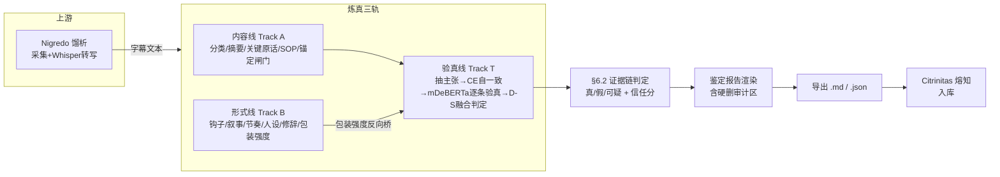
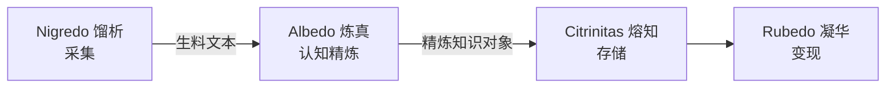

<p align="center">
  
</p>

<h1 align="center">炼真 · Albedo</h1>

<p align="center">
  
  
  
  
</p>

<p align="center"><b>你知识流水线的「质检提纯」关卡</b>——把从网上采来的教程、经验、卖课视频，炼成一份说人话的鉴定报告：这条可不可信、好在哪、能照着做的步骤是什么、来自哪段视频，并直接对接熔知入库。</p>

---

## 🤔 为什么需要炼真？

| 你现在的做法 | 用炼真之后 |
|---|---|
| 刷 B站 / 听课记笔记，信息散落、真假混着 | 一段文字 → 一份标准化鉴定报告 |
| 看卖课视频心动，分不清是干货还是话术 | 真实性 + 变现标注分开判，卖课 ≠ 假内容 |
| 想照搬别人的 SOP，但步骤散在 40 分钟视频里 | 自动提炼成可照搬的 SOP / 大纲，且每步钉死在字幕哪一句 |
| 收藏一堆，回头找不到「这条到底靠不靠谱」 | 每条都带可信度评分 + 来源溯源 |
| 学了就忘，没法沉淀成自己的知识库 | 精炼结果直接进熔知（Citrinitas）入库 |

---

## ✨ 项目亮点

1. **三轨正交分析**——一条内容同时走三条独立分析线：**内容线（讲什么）**、**验真线（真不真）**、**形式线（怎么讲）**，互不干扰又互相印证，比单维事实核查更贴近「这条经验值不值得学」。
2. **本地中文验真**——Layer2 用 **mDeBERTa-XNLI**（多语言含中文、确定性、可本地跑），把每条可证伪事实主张跟字幕原文逐条比对，判「支持 / 矛盾 / 未验证」，不依赖联网也能给出真验真结论。
3. **主张自一致性抽取**——抽原子主张时跑 N 次并集 + 文本归一化去重，过滤一次性幻觉与「上下文：」前缀变体；再经 checkworthiness 过滤，只保留可证伪事实主张进入验真，不污染判定。
4. **多轴分类 + 通用锚定闸门**——视频先按「结构 / 意图 / 变现方式」多轴分类（揭秘卖课不再被误判成教程）；萃取的 SOP 步骤 / 大纲 / 主张全部过锚定闸门：编造步骤直接剔除、无依据主张标 ⚠️ 保留，根治「幻觉式交付」。
5. **硬删留痕审计**——所有被过滤掉的主张（水词 / 观点 / 字幕无依据）不再「删了看不见」，而是进审计区逐条列出「原话 + 阶段 + 原因」，你一眼能看到有没有误杀，发现误杀直接反馈我调阈值。
6. **稳定性（缓存冻结）**——内容线 + 形式线 + 主张集 + 验真结论全部冻进带版本指纹的缓存，复查完全确定性复现，不再「同一个视频三次结果不一样」。
7. **分秒级溯源**——来自哪个视频 / UP主 / 时间戳，防「编造式交付」。
8. **入库就绪**——产出带 `ingestion_meta` 雏形的精炼对象，无缝对接熔知（Citrinitas）切块 / 向量化 / 入库。

---

## ⚔️ 核心能力 & 竞品对比

> 图例：✅ 已有　~ 部分涉及　🔮 规划中　— 无

| 对比维度 | 炼真 Albedo | 盘古 pangu | nuwa | OpenFactCheck |
|---|:--:|:--:|:--:|:--:|
| 真实性鉴定（真/假/可疑 + 证据分级） | ✅ | ✅ | ✅ | ✅ |
| **本地中文验真模型（mDeBERTa-XNLI）** | ✅ | — | — | — |
| 主张自一致性抽取 + checkworthiness 过滤 | ✅ | — | ~ | ~ |
| 多轴分类（结构/意图/变现） | ✅ | — | — | — |
| 通用锚定闸门（防幻觉式 SOP/主张） | ✅ | — | ~ | — |
| 硬删留痕审计（误杀可感知） | ✅ | — | — | — |
| 缓存冻结稳定性（复查确定性） | ✅ | — | — | — |
| 多维质量评估（文案/结构/逻辑分维度） | ✅ | — | ~ | — |
| 优点分析（核心洞察/可复用步骤/陷阱） | ✅ | ✅ | ✅ | — |
| 结构化提炼（可照搬 SOP） | ✅ | ~ | ~ | — |
| 分秒级来源溯源 | ✅ | — | — | ~ |
| 内容净化（纠错/去广告/翻译） | ✅ | — | — | — |
| 入库就绪报告（内嵌熔知分面元数据） | ✅ | ~ | ~ | ✅ |
| 平台无关（吃文字 + 归一化信号） | ✅ | — | — | ✅ |
| 流水线中段定位（对接采集/存储/变现） | ✅ | — | — | — |
| 多 SOP 并列产出对接 Rubedo | ✅ | — | — | — |
| 跨源矛盾检测（规模期） | 🔮 | — | — | — |
| 信任聚合 FPF | ✅ | — | ~ | — |
| **核心定位 / 各有千秋** | 一人公司流水线「质检提纯」关卡，强在把脏内容炼成可照搬的可信 SOP | 端到端人物/领域知识蒸馏成可安装 Skill | 方法论蒸馏 + 最严验证机制（三重验证 + 保真度评分卡） | 通用事实核查技术底座，可复用其统一核查管线 |

---

## 🔄 操作流程（三轨）



---

## 🏗️ 架构概览



| 层 | 职责 | 在本项目 |
|---|---|---|
| 上游采集 | 抓视频 / 群消息 → 生料文本（含 Whisper 转写） | Nigredo（不归炼真） |
| **炼真中段** | 净化 + 验真 + 提质 + 溯源 + 报告 + 硬删审计 | **本项目** |
| 下游存储 | 切块 / 向量化 / 入库 / 检索 | Citrinitas（不归炼真） |
| 下游变现 | 把精炼经验变可执行 SOP / 内容 | Rubedo（不归炼真） |

> 边界：炼真**不碰采集、不碰存储、不变现**，只做中间的「提炼 + 质检 + 优点萃取 + 审计」炼真段。

---

## 📁 目录结构

```
albedo/
├── app.py                    # Streamlit 主界面
├── run.bat                   # 双击启动（自动装依赖 + 开 8501）
├── flows/
│   └── refine.py             # 编排全链路（内容线+验真线+形式线）
├── core/                     # 炼真内核
│   ├── models.py             # 数据契约 AlbedoInput / RefinedKnowledgeObject / ClaimVerification
│   ├── llm.py                # DeepSeek 封装（空响应/截断韧性 + 续写游标）
│   ├── purify.py             # 内容净化（T2）
│   ├── assess.py             # 真实性评估 + 变现标注 + 数值自洽预检（T3）
│   ├── summary.py            # 内容摘要（A0）
│   ├── classify.py           # 多轴分类 structure/intent[]/monetization（AC1）
│   ├── content_track.py      # 内容线：关键句/高光/按类型萃取（CT2-CT4）
│   ├── ground_extract.py     # 通用锚定闸门（AC4/AC5：SOP剔除+主张标⚠️）
│   ├── merit.py              # 优点分析（A1）
│   ├── structure.py          # 结构化提炼 SOP/大纲（A2）
│   ├── provenance.py         # 来源溯源（A3）
│   ├── salience.py           # CE0 形式信号骨架（Top-K 时间桶覆盖）
│   ├── truth_track.py        # 验真线：抽主张(CE1+CE2)/忠实性(CE3)/防瞎编(L0.5)/聚合(TT6)/审计(F)
│   ├── claim_cache.py        # CE4 带版本指纹(verify_sig)的缓存冻结
│   ├── judgment.py           # §6.2 证据链 D-S 融合判定（JUDGE）
│   ├── minicheck_verify.py   # Layer2 本地验真（已重写为 mDeBERTa-XNLI）
│   ├── web_verify.py         # Layer3 联网核查框架（可插拔，缺 key 诚实降级 pending）
│   ├── form_track.py         # 形式线 FT0-FT7 + G1 包装强度 + G2 保真自检
│   ├── grounding.py          # 保真自检（CT5/形式线 G2 共用）
│   └── report.py             # 鉴定报告渲染（A4，含硬删审计区）
├── scripts/
│   ├── run_robustness_test.py   # 鲁棒性测试（默认轮间清缓存/轮内缓存）
│   └── _nigredo_transcribe_bridge.py  # 馏析→炼真 Whisper 桥（守跨项目边界）
├── data/
│   └── out/                  # 精炼结果 .json / .md + 测试日志
├── tests/                    # 单测（claim 稳定性 / 硬删审计 / 管线冒烟）
└── docs/                     # 调研 / 设计 / 审计 / ADR（详见下方「研究基础」）
```

---

## 🛠️ 技术栈

| 技术 | 用途 | 授权 |
|---|---|---|
| Python 3.13+ | 主语言 | PSF License |
| Streamlit | 交互界面 | Apache 2.0 |
| DeepSeek (LLM) | 优点分析 / 结构化 / 抽主张 / 防瞎编 NLI | 商用需自阅条款 |
| **mDeBERTa-XNLI** | Layer2 本地中文验真（确定性 NLI） | MIT |
| faster-whisper | 上游转写（属 Nigredo） | MIT |
| Qdrant | 下游向量库（属 Citrinitas） | Apache 2.0 |

> **双 Python 环境注意**：跑含 Layer2 验真的实测，必须用装有 `torch`/`transformers` 的环境（如系统 `C:/Python314/python.exe`）+ 命令前带 `LAYER2_MODEL_DIR=E:/tmp/mdeberta_xnli HF_HUB_OFFLINE=1 TRANSFORMERS_OFFLINE=1`。managed venv 无 torch 会让 Layer2 静默降级、结论退回「未验真默认值」。

---

## 🗺️ 路线图

| 版本 | 状态 | 内容 |
|---|:--:|---|
| v0.1.0 | ✅ 2026-07-09 | 单条内容「能不能信」闭环（净化 + 真实性 + 变现标注 → 入库就绪报告） |
| v0.2.0 | ✅ 2026-07-12 | 多维炼真（摘要 + 优点分析 8 子能力 + 结构化 SOP/大纲 + 溯源 + 鉴定报告渲染） |
| v0.2.1 | ✅ 2026-07-12 | 内容线：视频类型判断 + 按类型抽 SOP/决策表/论点图/概念卡 + 每句钉死字幕 + 防瞎编 |
| v0.3.0 | ✅ 2026-07-16 | 验真线：逐条断言验真（Layer0.5 防瞎编 / 话术识别 / 自相矛盾 / 时效 / 事实vs观点）+ 入库状态直送熔知 |
| v0.4.0 | ✅ 2026-07-16 | 形式线（钩子/叙事/节奏/人设/修辞/模板/情绪）+ G1 包装强度反向桥 + 三轴总览 |
| v0.4.1 | ✅ 2026-07-16 | §6.2 证据链 D-S 融合判定（取代自由 LLM 标签，根治翻转）+ TT6 MiniCheck 真实路径 |
| v0.4.2 | ✅ 2026-07-16 | MiniCheck 真部署（权重 + score API + 二分类 + corpus 自指修正） |
| v0.4.3 | ✅ 2026-07-16 | 抽主张重建：CE0 形式信号骨架 + CE1+CE2 自一致性并集 + CE3 忠实性 + CE4 缓存 + Layer3 框架 |
| v0.4.5 | ✅ 2026-07-16 | LLM 韧性层（空响应重试 / 截断续写游标 / 组合频率门槛去重） |
| v0.4.6 | ✅ 2026-07-16 | CE0 时间桶覆盖 + 审计修复（CE3 标记不删 / guard 回退 / 信任分反转 / 截断游标 / 缓存冻结最终主张） |
| v0.4.6.1 | ✅ 2026-07-17 | 缓存冻结形式线（trust_score 微抖根治） |
| v0.4.7 | ✅ 2026-07-17 | verify_sig 版本化缓存失效 + save 顺序修正冻结最终主张 + **mDeBERTa-XNLI 替换 MiniCheck** + 稳定性检查比完整主张 |
| **v0.4.8** | ✅ 2026-07-17 | 报告质量根治：多轴分类 + 混合路由+卖家声明 + 通用锚定闸门 + 快修(数值时间戳/包装文案) + checkworthiness 过滤 + 标签语义重构；发现 v4-flash 模型错配根因 |
| **v0.4.9** | ✅ 2026-07-17 | 内容线缓存冻结(治漂移) + 主张 ts 真实值 + 水主张强化过滤 + 验真缺失告警 + 硬删留痕审计 + 去重修复 + 馏析→炼真桥 |
| v0.5.0 | 🔮 | 置信度大改 + 跨源矛盾检测（规模期护城河）+ 溯源种类扩展 + B 类大模型级联核查（标注集建成后） |
| v1.0.0 | 🔮 | 五器耦合：模块化集成进 Opus Magnum 总指挥部 |

---

## 🔬 研究基础

炼真的每一个能力都不是拍脑袋定的，背后有一整套调研与设计文档（都在 `docs/`）。核心研究方向：

- **立项调研** `docs/ALBEDO-RESEARCH-2026-07-09.md`：对标 pangu / nuwa / OpenFactCheck / TubeScribed + 竞品全景，划定炼真边界。
- **内容线研究** `docs/RESEARCH-CONTENT-TRACK-2026-07-15.md` / `RESEARCH-CONTENT-SUMMARY-2026-07-15.md`：分类、关键句锚定、按类型萃取、保真自检的设计依据。
- **形式线研究** `docs/RESEARCH-FORM-TRACK-2026-07-16.md`：钩子/叙事/节奏/人设/修辞/模板/情绪的客观拆解方法。
- **验真方法研究**（5 篇）`docs/RESEARCH-TRUTH-VERIFICATION-2026-07-15.md`（V1~V3）/ `RESEARCH-TRUTH-METHODS-AUDIT-2026-07-16.md` / `RESEARCH-TRUTH-STABILITY-QUALITY-2026-07-16.md`：从「真假二分」到「证据链 D-S 融合」的演进，含竞品（PolitiFact / FActScore / SAFE）对标。
- **中文验真模型清单** `docs/RESEARCH-TRUTH-MODELS-CN-2026-07-17.md`：8 个中文友好验真候选对比，选定 mDeBERTa-XNLI 的理由与未来比较计划。
- **主张抽取设计** `docs/DESIGN-CLAIM-EXTRACTION-2026-07-16.md`（V1/V2）：自一致性并集 + CE0 骨架约束 + checkworthiness 过滤。
- **韧性 LLM 设计** `docs/DESIGN-RESILIENT-LLM-2026-07-16.md`：空响应/截断/漂移的根因与对策。
- **过滤器审计** `docs/FILTER-AUDIT-2026-07-17.md`：盘点全部硬删点，确立「隔离不销毁」原则与硬删留痕审计。
- **数据/竞品分析** `docs/RESEARCH-DATA-ANALYSIS-2026-07-15.md`（系列）、`ALBEDO-LEGACY-CODE-ANALYSIS-2026-07-09.md`：遗留代码梳理与对照。

> 完整清单见 `PROJECT_PLAN.md` 的「研究文档索引」一节。

---

## ⚡ 快速开始

```bash
# 1. 安装依赖（首次；也可直接双击 run.bat，它会自动装）
cd D:\albedo
pip install -r requirements.txt

# 2. 配置 .env（DeepSeek 密钥 + 模型）
KB_LLM_API_KEY=你的key
KB_LLM_BASE_URL=https://api.deepseek.com/v1
KB_LLM_MODEL=deepseek-chat          # 务必用非推理模型，避免截断重试（v0.4.8 根因）

# 3. （可选）启用 Layer2 本地中文验真
#    把 mDeBERTa-XNLI 权重放好（默认 E:/tmp/mdeberta_xnli），或设：
LAYER2_MODEL_DIR=E:/tmp/mdeberta_xnli

# 4. 启动（双击 run.bat 亦可）
run.bat            # 自动开 http://localhost:8501

# 5. 使用
#   ① 粘贴一段文本，或导入 Nigredo 落盘的 .txt / 中转 .md
#   ② 点「炼真」→ 出鉴定报告（含逐条验真 + 硬删审计区）
#   ③ 导出 .md / .json → 进熔知（Citrinitas）入库
```

---

## 👤 适合谁用

| 适合 | 不适合 |
|---|---|
| 一人公司主理人，想把学的干货沉淀成可复用 SOP | 想全自动抓取视频 / 群消息（那是 Nigredo 馏析） |
| 刷 B站 / 听课学经验，怕被卖课话术带偏 | 想要知识库检索问答（那是 Citrinitas 熔知） |
| 需要给每条经验标「可信度 + 来源」 | 想要直接发内容变现（那是 Rubedo 凝华） |
| 正在建自己的多业务线 SOP 库 | — |

---

## ❓ FAQ

**Q1：炼真和盘古 / nuwa 有什么区别？**
它们是端到端单人工具（自己采集、自己提炼、自己存）；炼真是五器分工里的「炼真中段」，只做认知精炼，不碰采集 / 存储 / 变现。

**Q2：为什么报告里有的维度是空的？**
某一步 LLM 失败时系统会安全降级、留空不崩，保证你始终拿到一份完整报告。对应维度标「（该维度未能生成）」。

**Q3：卖课内容一定判假吗？**
不会。变现标注与真实性结论解耦——卖课话术只是真实性评估的**证据之一**，绝不只凭「在卖课」就判假。

**Q4：验真是怎么做的，需要联网吗？**
主张抽取 + Layer0.5~Layer1（防瞎编/话术/矛盾/时效）全本地；Layer2 用本地 **mDeBERTa-XNLI** 把每条事实主张跟字幕逐条比对，也本地、确定性。只有 Layer3（联网深验外部事实）需要搜索 key，缺 key 时诚实标 `pending` 待你联网核查，不臆断。

**Q5：被过滤掉的内容看得到吗？**
看得到。报告有「🔍 被过滤主张（审计）」章节，逐条列出被删的原话 + 阶段 + 原因。如果你发现误杀，告诉我，我调阈值。

**Q6：精炼结果怎么进熔知？**
导出 `.json`（含 `ingestion_meta` 雏形）→ 熔知接收后做切块 / 向量化 / 入库，正式分面分类由熔知底层 facet 体系完成。

**Q7：为什么叫 Albedo / 炼真？**
炼金四阶段之「白化」（提纯去杂），英文功能名 Albedo；五器统一两段式命名（炼金阶段 + 中文功能名 / 英文功能名）。

---

## 🤝 贡献

欢迎提 Issue / PR。重大方向变更请先读 `BLUEPRINT.md`（项目宪法）与 `docs/ALBEDO-RESEARCH-2026-07-09.md`（立项调研），研究结论请同步进 `docs/` 并在 `PROJECT_PLAN.md` 研究索引登记。

## 📄 许可证

[MIT](LICENSE)

## 🙏 致谢

- 思路参考：[pangu-skill](https://github.com/)（盘古）/ [nuwa-skill](https://github.com/)（女娲）/ [OpenFactCheck](https://github.com/) / TubeScribed（SOP 格式）/ PolitiFact / FActScore / SAFE（验真方法论对标）
- 验真模型：[MoritzLaurer/mDeBERTa-v3-base-xnli-multilingual-nli-2mil7](https://huggingface.co/MoritzLaurer/mDeBERTa-v3-base-xnli-multilingual-nli-2mil7)
- 上游转写：faster-whisper（属 Nigredo 馏析）
- 大模型：DeepSeek

---

<p align="center">炼真 Albedo · 五器工坊之「校验」环节 · 把脏内容炼成可照搬的可信 SOP</p>
