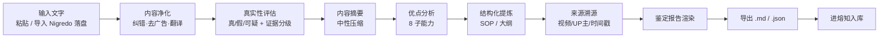
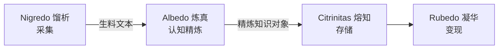

<p align="center">
  
</p>

<h1 align="center">炼真 · Albedo</h1>

<p align="center">
  
  
  
  
</p>

<p align="center"><b>你知识流水线的「质检提纯」关卡</b>——把从网上采来的教程、经验、卖课视频，炼成一份说人话的鉴定报告：这条可不可信、好在哪、能照着做的步骤是什么、来自哪段视频，并直接对接熔知入库。</p>

---

## 🤔 为什么需要炼真？

| 你现在的做法 | 用炼真之后 |
|---|---|
| 刷 B站 / 听课记笔记，信息散落、真假混着 | 一段文字 → 一份标准化鉴定报告 |
| 看卖课视频心动，分不清是干货还是话术 | 真实性 + 变现标注分开判，卖课 ≠ 假内容 |
| 想照搬别人的 SOP，但步骤散在 40 分钟视频里 | 自动提炼成可照搬的 SOP / 大纲 |
| 收藏一堆，回头找不到「这条到底靠不靠谱」 | 每条都带可信度评分 + 来源溯源 |
| 学了就忘，没法沉淀成自己的知识库 | 精炼结果直接进熔知（Citrinitas）入库 |

---

## ✨ 项目亮点

1. **多维鉴定，不是「真假二分」**——真实性 + 文案 + 结构 + 逻辑，组合成一张报告，比单维事实核查更贴近「这条经验值不值得学」。
2. **优点分析**——从经验里挖出核心洞察、可复用 SOP、差异化打法、陷阱预警，直接支撑你「多 SOP 并列」。
3. **结构化提炼**——视频字幕 / 长文 → 标准 SOP（TubeScribed 格式：目的 + 前置 + 步骤 + 警告 + 完成清单）或通用大纲。
4. **分秒级溯源**——来自哪个视频 / UP主 / 时间戳，防「编造式交付」。
5. **内容净化**——纠错、去广告、翻译归一，让下游吃得干净。
6. **入库就绪**——产出带 `ingestion_meta` 雏形的精炼对象，无缝对接熔知（Citrinitas）切块 / 向量化 / 入库。

---

## ⚔️ 核心能力 & 竞品对比

> 图例：✅ 已有　~ 部分涉及　🔮 规划中　— 无

| 对比维度 | 炼真 Albedo | 盘古 pangu | nuwa | OpenFactCheck |
|---|:--:|:--:|:--:|:--:|
| 真实性鉴定（真/假/可疑 + 证据分级） | ✅ | ✅ | ✅ | ✅ |
| 多维质量评估（文案/结构/逻辑分维度） | ✅ | — | ~ | — |
| 优点分析（核心洞察/可复用步骤/陷阱） | ✅ | ✅ | ✅ | — |
| 结构化提炼（可照搬 SOP） | ✅ | ~ | ~ | — |
| 分秒级来源溯源 | ✅ | — | — | ~ |
| 内容净化（纠错/去广告/翻译） | ✅ | — | — | — |
| 入库就绪报告（内嵌熔知分面元数据） | ✅ | ~ | ~ | ✅ |
| 平台无关（吃文字 + 归一化信号） | ✅ | — | — | ✅ |
| 流水线中段定位（对接采集/存储/变现） | ✅ | — | — | — |
| 多 SOP 并列产出对接 Rubedo | ✅ | — | — | — |
| 跨源矛盾检测（规模期） | 🔮 | — | — | — |
| 信任聚合 FPF | ✅ | — | ~ | — |
| **核心定位 / 各有千秋** | 一人公司流水线「质检提纯」关卡，强在把脏内容炼成可照搬的可信 SOP | 端到端人物/领域知识蒸馏成可安装 Skill | 方法论蒸馏 + 最严验证机制（三重验证 + 保真度评分卡） | 通用事实核查技术底座，可复用其统一核查管线 |

---

## 🔄 操作流程



---

## 🏗️ 架构概览



| 层 | 职责 | 在本项目 |
|---|---|---|
| 上游采集 | 抓视频 / 群消息 → 生料文本 | Nigredo（不归炼真） |
| **炼真中段** | 净化 + 验真 + 提质 + 溯源 + 报告 | **本项目** |
| 下游存储 | 切块 / 向量化 / 入库 / 检索 | Citrinitas（不归炼真） |
| 下游变现 | 把精炼经验变可执行 SOP / 内容 | Rubedo（不归炼真） |

> 边界：炼真**不碰采集、不碰存储、不变现**，只做中间的「提炼 + 质检 + 优点萃取」炼真段。

---

## 📁 目录结构

```
albedo/
├── app.py              # Streamlit 主界面
├── run.bat             # 双击启动（自动装依赖 + 开 8501）
├── core/               # 炼真内核
│   ├── models.py       # 数据契约 AlbedoInput / RefinedKnowledgeObject
│   ├── llm.py          # DeepSeek 封装
│   ├── purify.py       # 内容净化（T2）
│   ├── assess.py       # 真实性评估 + 变现标注（T3）
│   ├── summary.py      # 内容摘要（A0）
│   ├── merit.py        # 优点分析（A1）
│   ├── structure.py    # 结构化提炼（A2）
│   ├── provenance.py   # 来源溯源（A3）
│   └── report.py       # 鉴定报告渲染（A4）
├── flows/
│   └── refine.py       # 编排全链路（A5 / T7）
├── data/
│   └── out/            # 精炼结果 .json / .md
└── docs/               # 调研 / ADR / 路线图
```

---

## 🛠️ 技术栈

| 技术 | 用途 | 授权 |
|---|---|---|
| Python 3.13+ | 主语言 | PSF License |
| Streamlit | 交互界面 | Apache 2.0 |
| DeepSeek (LLM) | 优点分析 / 结构化 / 真实性评估 | 商用需自阅条款 |
| faster-whisper | 上游转写（属 Nigredo） | MIT |
| Qdrant | 下游向量库（属 Citrinitas） | Apache 2.0 |

---

## 🗺️ 路线图

| 版本 | 状态 | 内容 |
|---|:--:|---|
| v0.1.0 | ✅ 2026-07-09 | 单条内容「能不能信」闭环（净化 + 真实性 + 变现标注 → 入库就绪报告） |
| **v0.2.0** | ✅ 2026-07-12 | 多维炼真（摘要 + 优点分析 8 子能力 + 结构化 SOP/大纲 + 溯源 + 鉴定报告渲染） |
| v0.3.0 | 🔮 | 置信度大改 + 跨源矛盾检测（规模期护城河，复用 ds_fusion / tms 遗产） |
| v0.4.0 | 🔮 | 平台信号辅助可信度（Viblio 思路）+ 多题材兼容扩展 |
| v1.0.0 | 🔮 | 五器耦合：模块化集成进 Opus Magnum 总指挥部 |

---

## ⚡ 快速开始

```bash
# 1. 安装依赖（首次；也可直接双击 run.bat，它会自动装）
cd D:\albedo
pip install -r requirements.txt

# 2. 配置 .env（DeepSeek 密钥）
KB_LLM_API_KEY=你的key
KB_LLM_BASE_URL=https://api.deepseek.com/v1
KB_LLM_MODEL=deepseek-chat

# 3. 启动（双击 run.bat 亦可）
run.bat            # 自动开 http://localhost:8501

# 4. 使用
#   ① 粘贴一段文本，或导入 Nigredo 落盘的 .txt
#   ② 点「炼真」→ 出鉴定报告
#   ③ 导出 .md / .json → 进熔知（Citrinitas）入库
```

---

## 👤 适合谁用

| 适合 | 不适合 |
|---|---|
| 一人公司主理人，想把学的干货沉淀成可复用 SOP | 想全自动抓取视频 / 群消息（那是 Nigredo 馏析） |
| 刷 B站 / 听课学经验，怕被卖课话术带偏 | 想要知识库检索问答（那是 Citrinitas 熔知） |
| 需要给每条经验标「可信度 + 来源」 | 想要直接发内容变现（那是 Rubedo 凝华） |
| 正在建自己的多业务线 SOP 库 | — |

---

## ❓ FAQ

**Q1：炼真和盘古 / nuwa 有什么区别？**
它们是端到端单人工具（自己采集、自己提炼、自己存）；炼真是五器分工里的「炼真中段」，只做认知精炼，不碰采集 / 存储 / 变现。

**Q2：为什么报告里有的维度是空的？**
某一步 LLM 失败时系统会安全降级、留空不崩，保证你始终拿到一份完整报告。对应维度标「（该维度未能生成）」。

**Q3：卖课内容一定判假吗？**
不会。变现标注与真实性结论解耦——卖课话术只是真实性评估的**证据之一**，绝不只凭「在卖课」就判假。

**Q4：精炼结果怎么进熔知？**
导出 `.json`（含 `ingestion_meta` 雏形）→ 熔知接收后做切块 / 向量化 / 入库，正式分面分类由熔知底层 facet 体系完成。

**Q5：为什么叫 Albedo / 炼真？**
炼金四阶段之「白化」（提纯去杂），英文功能名 Albedo；五器统一两段式命名（炼金阶段 + 中文功能名 / 英文功能名）。

---

## 🤝 贡献

欢迎提 Issue / PR。重大方向变更请先读 `docs/BLUEPRINT.md`（项目宪法）与 `docs/ALBEDO-RESEARCH-2026-07-09.md`（立项调研）。

## 📄 许可证

[MIT](LICENSE)

## 🙏 致谢

- 思路参考：[pangu-skill](https://github.com/)（盘古）/ [nuwa-skill](https://github.com/)（女娲）/ [OpenFactCheck](https://github.com/) / TubeScribed（SOP 格式）
- 上游转写：faster-whisper（属 Nigredo 馏析）
- 大模型：DeepSeek

---

<p align="center">炼真 Albedo · 五器工坊之「校验」环节 · 把脏内容炼成可照搬的可信 SOP</p>
